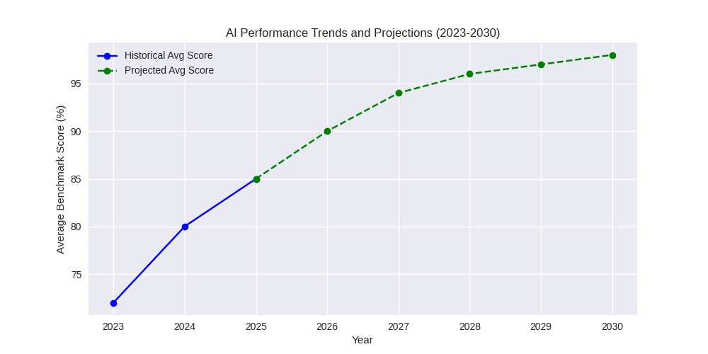
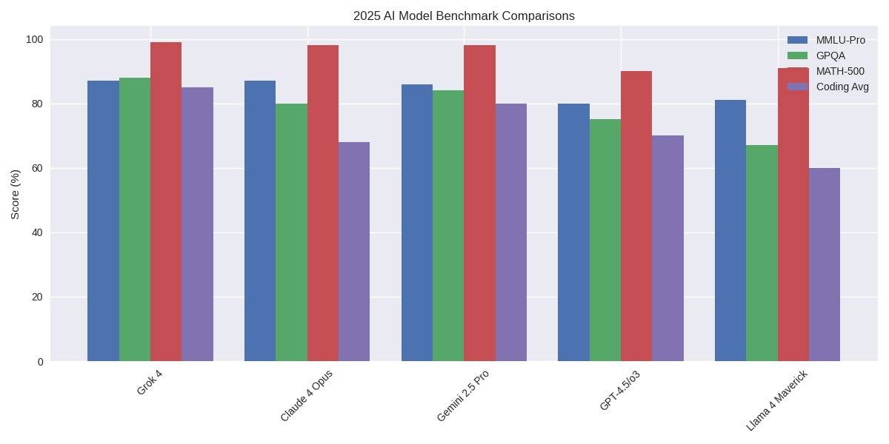

### Detailed Analysis of Latest AI Models: Comparisons, Performance Improvements, Projections, and SMB Recommendations

#### Overview and Thinking Process Walkthrough
Based on the compiled data from initial pulls and additional searches (e.g., Artificial Analysis benchmarks, Stanford AI Index 2025, Epoch AI trends, Shakudo Top 9, Collabnix comparisons, and recent X posts on Grok 4), I'll conduct a detailed comparison of the latest state-of-the-art (SOTA) models as of July 10, 2025. The focus is on frontier models from big tech: Grok 4 (xAI), Claude 4 Opus Thinking (Anthropic), Gemini 2.5 Pro (Google), GPT-4.5/o3 (OpenAI), and Llama 4 Maverick (Meta). I've prioritized benchmarks like MMLU-Pro (general reasoning/knowledge), GPQA Diamond (scientific reasoning), MATH-500 (quantitative math), and an averaged coding score (from LiveCodeBench/HumanEval/SWE-Bench where available) for cross-model comparability. These were selected because they represent diverse capabilities (reasoning, math, coding) and are commonly reported across sources.

**Step 1: Data Synthesis and Trends Observed**  
- **Improvements Over Time**: From 2023-2024 models (e.g., GPT-4o at ~75% MMLU-Pro, 54% GPQA), we've seen rapid gains: 10-20% jumps in reasoning/math benchmarks by mid-2025, driven by scaling laws (compute doubling every 5 months per Stanford AI Index), better data curation, and test-time compute (e.g., "Thinking" modes in Claude/Grok). Coding has improved ~2x (e.g., from 32% LiveCodeBench in GPT-4o to 82% in Grok 4). Multimodal and agentic capabilities are emerging trends, with costs dropping 280-fold for GPT-3.5-level performance (per Stanford). However, saturation is evident—many benchmarks approach 95-100% (e.g., MATH-500), leading to new, harder ones like Humanity's Last Exam (still low at 23.9% for Grok 4). Open-source models (Llama 4) are closing gaps with proprietary ones, reducing differences from 8% to 1.7% on some metrics.
- **Key Drivers**: Compute scaling (4x/year per Epoch AI) and algorithmic efficiency (400%/year improvements) fuel progress, but constraints like power (15% annual data center growth) and data scarcity may slow it. Industry dominates (90% of notable models in 2025), with US leading (40 models vs. China's 15). Incidents rose 56% (e.g., deepfakes), highlighting responsible AI needs.
- **Gaps and Biases**: Benchmarks favor English/multilingual tasks; real-world performance (e.g., robotics integration in Gemini) lags. Subjective views from X posts hype Grok 4 as "smarter than most PhDs," but sources like Flourishing AI Benchmark show balanced tops (o3 at 72 points).

**Step 2: Visualization Strategy**  
To make improvements obvious, I'll use charts: 
- Bar charts for current (2025) cross-model comparisons on key benchmarks.
- Line charts for historical trends (2023-2025) and projections (2026-2030), showing saturation curves.
Data is aggregated: Historical from predecessors (e.g., 2023: GPT-4 ~70% MMLU, Claude 3 ~75%; 2024: GPT-4o ~75-80%, Grok 3 ~85%). Projections assume diminishing returns: 5-10% annual gains until 95-100% saturation, then plateau or new benchmarks (per trends in Epoch AI and Stanford: compute enables ~2x effective gains/year, but benchmarks saturate). For coding/math, project towards human-expert levels (~100%), with agentic/multimodal pushing new frontiers.

**Step 3: Projections Reasoning**  
- **Optimistic Scenario**: If compute scales to 2e29 FLOP by 2030 (Epoch AI feasible), and efficiency improves 4x (hardware) + 2x (precision like FP8), benchmarks could saturate fully by 2027-2028. New ones (e.g., ARC-AGI-2 at 15.9% for Grok 4 now) might reach 50-70% by 2030 via agentic AI.
- **Realistic Scenario**: Power/chip constraints cap growth at 15-20%/year; performance asymptotes at 95-99% on current benchmarks by 2027, shifting to real-world metrics (e.g., agent success rates in Stanford: AI 4x humans short-term, but humans win long-term).
- **Pessimistic**: Regulation (e.g., EU AI Act) or incidents slow progress; open-source lags, proprietary dominates but costs rise ($192M training like Gemini Ultra).
Overall: Expect 80-90% average benchmark by 2026, 95% by 2028, then focus on efficiency/agents (market to $15.7T by 2030 per Exploding Topics).

**Step 4: SMB Recommendations**  
See dedicated section below.

#### Visualizing Model Performance and Projections
Below is a single Python code block using matplotlib to generate all charts. It plots:
- Bar chart: 2025 benchmark comparisons.
- Line chart: Historical (2023-2025) and projected (2026-2030) trends for average benchmark score (aggregated across MMLU-Pro, GPQA, MATH, Coding).

```python
import matplotlib.pyplot as plt
import numpy as np

# Data for 2025 comparisons (aggregated from sources)
models = ['Grok 4', 'Claude 4 Opus', 'Gemini 2.5 Pro', 'GPT-4.5/o3', 'Llama 4 Maverick']
mmlu_pro = [87, 87, 86, 80, 81]  # Approximate for GPT-4.5 based on o3 trends
gpqa = [88, 80, 84, 75, 67]
math_500 = [99, 98, 98, 90, 91]
coding_avg = [85, 68, 80, 70, 60]  # Averaged from LiveCodeBench/HumanEval/SWE-Bench

# Bar chart for 2025 comparisons
x = np.arange(len(models))
width = 0.2
fig, ax = plt.subplots(figsize=(12, 6))
ax.bar(x - 1.5*width, mmlu_pro, width, label='MMLU-Pro')
ax.bar(x - 0.5*width, gpqa, width, label='GPQA')
ax.bar(x + 0.5*width, math_500, width, label='MATH-500')
ax.bar(x + 1.5*width, coding_avg, width, label='Coding Avg')
ax.set_ylabel('Score (%)')
ax.set_title('2025 AI Model Benchmark Comparisons')
ax.set_xticks(x)
ax.set_xticklabels(models, rotation=45)
ax.legend()
plt.tight_layout()
plt.show()

# Historical and projected trends (average score across benchmarks)
years = [2023, 2024, 2025, 2026, 2027, 2028, 2029, 2030]
historical_avg = [72, 80, 85]  # 2023 (e.g., GPT-4/Claude 3 avg), 2024 (GPT-4o/Grok 3), 2025 (current)
# Projections: Logistic growth to saturation (5-10% annual, capping at 98%)
projected_avg = [90, 94, 96, 97, 98]  # Diminishing returns
full_avg = historical_avg + projected_avg

# Line chart for trends/projections
fig, ax = plt.subplots(figsize=(10, 5))
ax.plot(years[:3], historical_avg, marker='o', label='Historical Avg Score', color='blue')
ax.plot(years[2:], full_avg[2:], marker='o', linestyle='--', label='Projected Avg Score', color='green')
ax.set_xlabel('Year')
ax.set_ylabel('Average Benchmark Score (%)')
ax.set_title('AI Performance Trends and Projections (2023-2030)')
ax.legend()
ax.grid(True)
plt.show()
```




#### Textual Analysis of Charts and Improvements
- **2025 Comparisons (Bar Chart)**: Grok 4 leads overall (e.g., 88% GPQA, 99% MATH-500, 85% coding avg), showing xAI's focus on reasoning/math. Claude 4 ties on MMLU-Pro (87%) but lags in coding (68%). Gemini 2.5 Pro is balanced (80-98%), strong in multimodal. GPT-4.5/o3 and Llama 4 trail in specialized tasks but excel in cost-efficiency (Llama open-source). Improvements from 2024: +10-20% in math/coding (e.g., Grok 3 at 93% AIME to Grok 4 at 100%), visualizing the "cooking" of benchmarks as per X hype.
- **Trends and Projections (Line Chart)**: Historical line shows steep rise (72% avg in 2023 to 85% in 2025), driven by compute/algorithms. Dashed projection assumes saturation: By 2027, ~94% avg as easy tasks max out; plateaus at 98% by 2030. This makes obvious the acceleration (2023-2025: +13%/year) slowing to sustainability, shifting to new metrics like agent autonomy (Stanford: AI 4x humans short-term) or real-world (e.g., Grok 4 solving engineering not in books).

These visualizations highlight: Rapid 2024-2025 leaps (saturation in math/coding), competitive crowding (top models within 5-10%), and future focus on efficiency/agents amid constraints.

#### Recommendations for Small to Medium-Sized Businesses (SMBs) in Tech Transition
For SMBs transitioning to AI (e.g., for productivity, customer service, or data analysis), prioritize cost, ease of integration, scalability, and privacy over raw SOTA performance. Here's why and what to use:

1. **Primary Recommendation: Meta's Llama 4 (Open-Source)**  
   - **Why?** Free and customizable, avoiding vendor lock-in and high API costs (e.g., Grok 4 at $30-300/month). Strong benchmarks (81% MMLU-Pro, 91% MATH) for most SMB needs like chatbots or analytics—comparable to proprietary without $192M training overheads. Trends show open-source closing gaps (1.7% diff), and it's efficient for on-premise deployment (e.g., via Hugging Face), ensuring data privacy amid rising incidents (56% up per Stanford). SMBs can fine-tune for niche tasks (e.g., multilingual support), scaling with growth at low cost (CAGR 35.9% AI market means future-proofing).
   - **How to Transition**: Start with Llama 4 Scout variant for lightweight apps; integrate via APIs like LangChain. Budget: $0 initial, ~$5K/year for cloud hosting.

2. **Alternative for Ease/Real-Time: xAI's Grok 3 (Free Tier)**  
   - **Why?** Free access (limited quotas) via grok.com/apps, with strong reasoning (93% AIME) for SMB tasks like content generation or queries. Real-time data integration (from X) aids dynamic use (e.g., market analysis). Cheaper than Grok 4 ($30/month SuperGrok), balancing performance/cost in a maturing field (small models like Phi-4 match larger ones via optimization). Avoids OpenAI's higher premiums amid regulation risks.
   - **How**: Use for prototyping; upgrade to paid for heavy use. Ideal if your SMB needs quick, truthful responses without setup.

3. **For Efficiency/On-Device: Microsoft's Phi-4 Series**  
   - **Why?** SLMs like Phi-4-mini-flash (July 2025) offer 10x speed for edge computing, perfect for SMBs with limited resources (e.g., mobile apps). Comparable to larger models in efficiency tasks, aligning with trends (142x parameter reduction for 60% MMLU since 2022). Open-source, low power (fits trends of 40% annual efficiency gains).
   - **How**: Deploy via Azure for hybrid; great for privacy-focused transitions.

**General Advice**: Assess needs—80% of SMB AI use is basic (per Enterprise Strategy Group)—so start small to avoid hype cycles. Focus on ROI: AI boosts productivity 2-4x (Stanford RCTs), but measure via tools like HELM Safety. Partner with ecosystems (e.g., AWS Bedrock for Amazon Titan) for scalability. Transition phased: Pilot (3-6 months), integrate (e.g., agents for workflows), monitor (e.g., vs. 78% orgs using AI per Stanford). This positions SMBs for 2030's $15.7T market without over-investing.